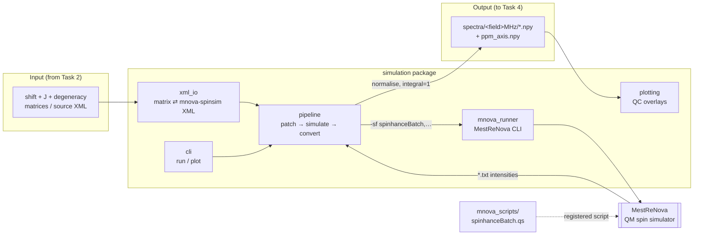

# SpinHance — Simulation (Task 3)

This package turns spin-system parameters (chemical shifts, *J*-couplings, and
proton degeneracies) into simulated ¹H NMR spectra at two field strengths, using
MestReNova's quantum spin simulator. It is the bridge between **Task 2**
(molecule → matrix) and **Task 4** (spectrum → matrix model).

- **Low field — 90 MHz:** strongly coupled, non-first-order. This is the model's
  *input*.
- **High field — 600.15 MHz:** first-order reference. Useful for validation and
  as an optional second input.

Output is a normalised intensity array of `16384 = 2¹⁴` points over `0–12 ppm`
(integral = 1), saved as `.npy`.

---

## Architecture



### Pipeline stages

1. **Patch** (`pipeline.prepare_xmls` → `xml_io.patch_frequency`): for each
   source XML, write one frequency-patched copy per field into
   `xmls/<field>MHz/`.
2. **Simulate** (`pipeline.run_mnova_batch` → `mnova_runner`): launch MestReNova
   on each field's directory. The registered `spinhanceBatch.qs` opens every
   XML, runs the simulation, and writes one `<stem>.txt` of intensities into
   `txt/<field>MHz/`.
3. **Convert** (`pipeline.txt_to_npy`): load each `.txt`, normalise to unit
   integral, and save `spectra/<field>MHz/<stem>.npy` plus a shared
   `ppm_axis.npy`.

---

## Layout

```
simulation/
├── README.md            # this file (human-facing)
├── CLAUDE.md            # AI-facing contract: interfaces, invariants, gotchas
├── __init__.py          # public API re-exports
├── xml_io.py            # matrix ⇄ mnova-spinsim XML (pure, no MNova/numpy deps)
├── mnova_runner.py      # MestReNova CLI invocation
├── pipeline.py          # patch → simulate → convert orchestration
├── plotting.py          # QC plot of 90 vs 600 MHz spectra
├── cli.py               # `python -m simulation.cli run|plot`
├── mnova_scripts/
│   └── spinhanceBatch.qs   # MNova JS batch script (register this folder)
├── benchmarks/
│   └── benchmark_fields.py # throughput benchmark over a geometric field grid
└── tests/
    ├── test_xml_io.py           # XML/matrix unit tests (no MNova required)
    └── test_benchmark_fields.py # frequency-grid unit tests (no MNova)
```

---

## One-time MNova setup

MestReNova must be told where the batch script lives:

1. Open MestReNova → **Edit → Preferences → Scripting → Directories**.
2. Add this folder: `simulation/mnova_scripts`.
3. **Restart** MestReNova.

This is required because `-sf` only resolves function names from registered
directories, and the file name (`spinhanceBatch.qs`) must equal the function
name (`spinhanceBatch`). See `CLAUDE.md` for the full list of invocation rules.

---

## Usage

All commands are run with the `spinhance` env active.

```bash
micromamba activate spinhance
```

Optionally install the package so you get a `spinhance-sim` command and can
import `simulation` from anywhere (run once, from the repo root):

```bash
pip install -e .
```

With it installed, `spinhance-sim run …` is equivalent to
`python -m simulation.cli run …`. The examples below use the module form, which
works from the repo root without installing.

### Run the pipeline

```bash
python -m simulation.cli run \
    --xml_dir data/processed/xmls_source \
    --out_dir data/processed \
    --mnova   "/Applications/MestReNova.app/Contents/MacOS/MestReNova" \
    --fields  90 600 \
    --workers 8            # parallel MNova instances (default 1 = sequential)
```

#### Parallelism

MNova's batch loop is single-threaded, so a single launch uses one core. With
`--workers N`, the XMLs are round-robin sharded across `N` concurrent MNova
instances for roughly `N`× throughput, up to your core count. Round-robin
spreads the costly high-field simulations evenly across workers.

Because MestReNova is single-instance, parallel workers launch with
`open -na MestReNova --args …` (the default `--launcher open`) to force separate
processes. If `open` does not pass `-sf` through on your machine (you'll see
0 outputs), use `--launcher direct`. Verify your machine supports concurrent
instances with the 30-second test in the benchmark section before scaling up.

### QC plot one molecule

```bash
python -m simulation.cli plot \
    --spectra_dir data/processed/spectra \
    --stem mol_test --show
```

### Programmatic API

```python
from simulation import matrix_to_xml, save_xml, run_pipeline

# Build a spin-system XML from matrix parameters
tree = matrix_to_xml(shifts, couplings, degeneracy, frequency_mhz=90.0)
save_xml(tree, "mol_001.xml")

# Or run the whole pipeline over a folder of source XMLs
from pathlib import Path
run_pipeline(Path("data/processed/xmls_source"), Path("data/processed"))
```

---

## Tests

```bash
python -m pytest simulation/tests -v
```

The tests cover label generation, XML construction, *J*-coupling symmetry,
save/reload round-trips, frequency patching, field-pair generation, and the
geometric frequency grid. They do **not** require MestReNova.

## Benchmark

Measure simulator throughput by patching one XML to `n` geometrically-spaced
frequencies (denser at low field) and simulating them all in a single MNova
launch. A small calibration run separates startup overhead from marginal
per-simulation cost.

```bash
python -m simulation.benchmarks.benchmark_fields \
    --source_xml "predicted_mnova_1h (10).xml" \
    --mnova "/Applications/MestReNova.app/Contents/MacOS/MestReNova" \
    --n 100 --fmin 40 --fmax 1200
```

The report prints total wall-clock, naive per-sim (`total / n`), estimated MNova
startup overhead, marginal per-sim time, and throughput (sims/s).

Add `--workers N` to benchmark parallel throughput (the report then shows
wall-clock throughput and estimated speedup instead of the single-launch
startup/marginal split). Sweep a few values to find the sweet spot:

```bash
for W in 1 2 4 6 8; do
  python -m simulation.benchmarks.benchmark_fields \
      --source_xml "predicted_mnova_1h (10).xml" \
      --mnova "/Applications/MestReNova.app/Contents/MacOS/MestReNova" \
      --n 100 --workers $W
done
```

Before scaling up, confirm your machine runs concurrent MNova instances
(MestReNova is single-instance by default):

```bash
pkill -i mestrenova
open -na MestReNova --args -sf spinhanceBatch,/tmp/shardA,/tmp/shardA_out &
open -na MestReNova --args -sf spinhanceBatch,/tmp/shardB,/tmp/shardB_out &
# Both output dirs should fill, and Activity Monitor should show two processes.
```

---

## Gotchas (the short list)

- **Do not pass `-nogui`** — MNova hangs on exit (no event loop for
  `Application.quit()`); the window must be visible. Output is still written.
- **`-sf` syntax:** single dash, function name without parentheses, args
  comma-separated: `-sf spinhanceBatch,<xmlDir>,<outDir>`.
- **No top-level call** in `spinhanceBatch.qs` — it would auto-run at startup
  before the NMR API exists and crash MNova.
- Editing the `.qs` while the Script Editor is open: reload it from disk; the
  editor caches the previously loaded copy.

The authoritative, detailed version of these is in `CLAUDE.md`.
