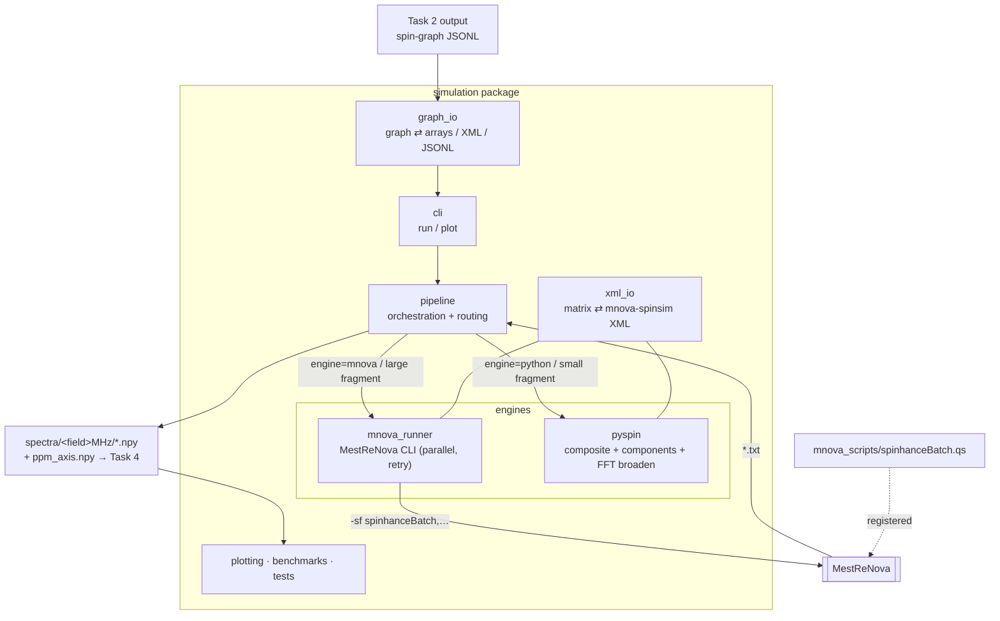

# SpinHance — Simulation (Task 3)

Turn spin-system parameters (chemical shifts δ, scalar couplings *J*, and proton
degeneracies) into simulated ¹H NMR spectra at two field strengths. This is the
bridge between **Task 2** (molecule → spin-graph) and **Task 4** (spectrum →
matrix model).

**Task 2 input format** (`graph_io.py`, matches `mol_to_matrix/data`): a single
JSON **array**; each element is one molecule:

```json
{"chembl_id": "CHEMBL6622", "smiles": "...", "inchikey": "...",
 "labels": ["A", "B", "C"],
 "spin_groups": [[1.06, 3], [2.02, 1], [7.20, 2]],
 "couplings": [["A", "B", 6.6], ["B", "C", 7.8]]}
```

`spin_groups[i]` (= `[shift ppm, #protons]`) describes `labels[i]`; `couplings`
lists non-zero inter-group J (Hz, sign retained); absent pairs mean J = 0. The
pyspin engine consumes records directly; the MNova path materialises XMLs from
them. Schema field names live in `graph_io.py` constants.

This JSON array is the **only** input format used for the production dataset
(the per-molecule `.npy`/`.json` path mentioned in `mol_to_matrix` is not used by
Task 3). Run it with `--graphs mol_to_matrix/data/spin_systems.json`.

- **Low field — 90 MHz:** strongly coupled, non-first-order. The model's *input*.
- **High field — 600.15 MHz:** first-order reference / optional second input.

Every spectrum is a normalised intensity array of `16384 = 2¹⁴` points over
`0–12 ppm` (∫ = 1), saved as `.npy`.

## Two engines, one interface

Both are selected with `--engine` and produce identical output layout.

| | `mnova` | `python` (pyspin) |
|---|---|---|
| Method | MestReNova QM simulator | pure-Python exact (composite reduction) |
| Speed | ~1 s/molecule (+~2.5 s startup) | µs–ms for sparse molecules |
| Parallelism | ~none (single-instance license) | scales across all cores / HPC |
| Dependency | MNova license, macOS | numpy only; runs anywhere |
| Scaling limit | linear (local-cluster approx) | exact ≤~12 coupled spins, then auto local-cluster ⇒ linear |

- **`mnova`** — drives MestReNova. Accurate and scales to large coupled systems
  (it uses a local-cluster approximation), but ~1 s/molecule with negligible
  multi-instance speedup, and macOS-only.
- **`python`** (pyspin) — composite-particle reduction for equivalent groups +
  connected-component decomposition. License-free, parallel across cores,
  HPC-capable. Validated against MNova (r ≈ 0.993–0.999, peak offset ≈ 0.0008
  ppm). Exact for coupled fragments ≤ ~12 spins; **larger fragments fall back
  automatically to a local-cluster approximation** (`pyspin.cluster`, the same
  trick MNova uses — exact within ~9-spin clusters, first-order between them),
  so there's no hard wall. Linear scaling: a 100-spin chain simulates in ~0.2 s.
- **`auto`** — routes each molecule by its largest connected-component spin count:
  ≤ `--pyspin-max-spins` (default 13) → pyspin, larger → MNova. Prints the routing
  distribution so you can see what fraction of a dataset needs MNova.

---

## Architecture



### MNova pipeline stages

1. **Patch** (`pipeline.prepare_xmls` → `xml_io.patch_frequency`): one
   frequency-patched XML per field in `xmls/<field>MHz/`.
2. **Simulate** (`pipeline.run_mnova_parallel` → `mnova_runner`): launch
   MestReNova on each field's directory; `spinhanceBatch.qs` writes one
   `<stem>.txt` of intensities into `txt/<field>MHz/`.
3. **Convert** (`pipeline.txt_to_npy`): normalise to unit integral, save
   `spectra/<field>MHz/<stem>.npy` + shared `ppm_axis.npy`.

The `python` engine skips MNova/txt entirely: `pyspin.batch` reads each XML
(`xml_io.xml_to_matrix`) and writes the normalised `.npy` directly, in parallel.

---

## Layout

```
simulation/
├── README.md            # this file (human-facing)
├── CLAUDE.md            # AI-facing contract: interfaces, invariants, gotchas
├── __init__.py          # public API re-exports
├── graph_io.py          # Task 2 contract: spin-graph ⇄ arrays/XML, JSONL I/O
├── xml_io.py            # matrix ⇄ mnova-spinsim XML (pure; matrix_to_xml / xml_to_matrix)
├── mnova_runner.py      # MestReNova CLI: run_mnova_batch / run_mnova_parallel
├── pipeline.py          # orchestration: run_pipeline (engine mnova/python/auto)
├── plotting.py          # QC overlay of 90 vs 600 MHz spectra
├── export.py            # pack spectra/ → one .tar.gz (sparsify + gzip)
├── cli.py               # `python -m simulation.cli run|plot|export`
├── mnova_scripts/
│   └── spinhanceBatch.qs   # MNova JS batch script (register this folder once)
├── pyspin/                 # pure-Python engine (engine="python")
│   ├── simulator.py          # spin-½ reference sim + shared FFT broadening
│   ├── composite.py          # composite-particle reduction + component split
│   ├── cluster.py            # local-cluster approximation (wall-free dispatcher)
│   ├── batch.py              # multiprocessing XML→npy driver
│   └── validate_vs_mnova.py  # accuracy check against MNova
├── benchmarks/
│   ├── benchmark_fields.py   # throughput over a geometric field grid (MNova)
│   ├── benchmark_pyspin.py   # pyspin parallel-scaling sweep (sims/s vs workers)
│   └── benchmark_scaling.py  # per-engine ceiling: grow a fully-coupled system
├── examples/               # sample spin systems + validation overlays
└── tests/                  # 45 tests, no MNova required
    ├── test_xml_io.py            # XML build/parse/patch/round-trip
    ├── test_graph_io.py          # spin-graph contract: arrays/xml/JSONL round-trips
    ├── test_mnova_runner.py      # parallel runner helpers (shard/launch cmd)
    ├── test_benchmark_fields.py  # geometric frequency grid
    ├── test_composite.py         # composite == explicit; components; high-deg
    └── test_cluster.py           # clustered ≈ exact; partition; wall-free
```

---

## Install / environment

```bash
micromamba activate spinhance
pip install -e .          # optional: gives the `spinhance-sim` command
```

`spinhance-sim run …` ≡ `python -m simulation.cli run …`. Examples below use the
module form (works from the repo root without installing).

### One-time MNova setup (only for the `mnova`/`auto` engines)

1. MestReNova → **Edit → Preferences → Scripting → Directories**.
2. Add `simulation/mnova_scripts`.
3. **Restart** MestReNova.

`-sf` only resolves function names from registered directories, and the file
name (`spinhanceBatch.qs`) must equal the function name. See `CLAUDE.md`.

---

## Usage

### From Task 2 spin-graphs (JSONL)

```bash
# pyspin consumes the graphs directly
python -m simulation.cli run --graphs data/processed/graphs.jsonl \
    --out_dir data/processed --fields 90 600 --engine python --workers 8

# mnova / auto first materialise XMLs from the graphs, then simulate
python -m simulation.cli run --graphs data/processed/graphs.jsonl \
    --out_dir data/processed --fields 90 600 --engine auto --workers 8 \
    --mnova "/Applications/MestReNova.app/Contents/MacOS/MestReNova"
```

Outputs `spectra/<field>MHz/mol_<i>.npy` (index = JSONL line) plus
`spectra/index.csv` mapping each spectrum to its molecule id (SMILES).

### From source XML directory (pure-Python engine)

```bash
python -m simulation.cli run \
    --xml_dir data/processed/xmls_source --out_dir data/processed \
    --fields 90 600 --engine python --workers 8
```

No MNova or license; parallel across cores (BLAS pinned to one thread/worker).

### Auto router (pyspin where it's fast, MNova where it's needed)

```bash
python -m simulation.cli run \
    --xml_dir data/processed/xmls_source --out_dir data/processed \
    --fields 90 600 --engine auto --workers 8 --pyspin-max-spins 13 \
    --mnova "/Applications/MestReNova.app/Contents/MacOS/MestReNova"
```

Prints e.g. `threshold 13: pyspin 80%, MNova 20%`.

### MNova engine

```bash
python -m simulation.cli run \
    --xml_dir data/processed/xmls_source --out_dir data/processed \
    --mnova "/Applications/MestReNova.app/Contents/MacOS/MestReNova" \
    --fields 90 600 --workers 8 --launcher open
```

`--workers N` round-robin shards across N MNova instances. MestReNova is
single-instance, so workers launch via `open -na` (`--launcher open`); if `open`
doesn't pass `-sf` on your machine (0 outputs), use `--launcher direct`. Failed
shards (e.g. license-seat starvation) are retried automatically.

### QC plot

```bash
python -m simulation.cli plot --spectra_dir data/processed/spectra --stem mol_001 --show
```

### Export a dataset to one tarball

```bash
python -m simulation.cli export --spectra_dir simulation/data/spectra \
    --out simulation/data/spectra.tar.gz        # sparsified (default), cutoff 0.001
# options: --no-sparsify (store dense), --cutoff 0.001, --no-renormalize
```

Sparsify drops points ≤ `cutoff × max` per spectrum (the long Lorentzian tails;
~86% of points at 0.001, keeping 98.6% of the integral) and stores
`(int32 indices, float32 values)`, renormalised so ∫=1. Two progress bars:
*compressing* (per spectrum) then *zipping* (gzip). Reconstruct a sparse
`mol_<i>.npz` with `simulation.export.load_spectrum` → `y = zeros(n); y[idx] = val`.

### Programmatic API

```python
from pathlib import Path
from simulation import matrix_to_xml, save_xml, run_pipeline
from simulation.xml_io import xml_to_matrix
from simulation.pyspin.composite import simulate_spectrum_composite

tree = matrix_to_xml(shifts, couplings, degeneracy, frequency_mhz=90.0)
save_xml(tree, "mol_001.xml")

ppm, spectrum = simulate_spectrum_composite(shifts, couplings, degeneracy, 90.0)

run_pipeline(Path("xmls_source"), Path("out"), engine="python", workers=8)
```

---

## Tests

```bash
python -m pytest simulation/tests -v        # 32 tests, no MNova required
```

Cover: XML build/parse/patch/round-trip, label generation, *J* symmetry,
field-pair naming, frequency-grid math, parallel-runner helpers, and — most
importantly — that the composite engine matches the explicit spin-½ simulator
(corr 1.0), including connected-component decomposition and high-degeneracy
(isopropyl 6H, methyl, singlet) cases.

---

## Benchmarks

```bash
# MNova throughput over a geometric field grid (startup vs per-sim)
python -m simulation.benchmarks.benchmark_fields --source_xml simulation/examples/R_5_methylcyclohexenone.xml \
    --mnova "<MestReNova>" --n 100 --fmin 90 --fmax 600        # add --workers N, --per-field

# pyspin parallel scaling (sims/s vs worker count; projects 100k-dataset time)
python -m simulation.benchmarks.benchmark_pyspin --source_xml simulation/examples/R_5_methylcyclohexenone.xml \
    --n 500 --fields 90 600 --workers-sweep 1 2 4 6 8

# per-engine ceiling: grow a fully-coupled chain until 2-min cutoff
python -m simulation.benchmarks.benchmark_scaling --engines pyspin mnova \
    --mnova "<MestReNova>" --start 10 --max 20 --timeout 120
```

Measured (fully-coupled chain = worst case): the **exact** engine costs ~
`C(N,N/2)³` — N=14 ≈ 12 s, N=15 ≈ 85 s, N≥16 > 2 min (this is why the dispatcher
hands large fragments to clustering at ~12 spins). The **clustered** engine is
linear: N=14 ≈ 0.007 s (corr 0.992 vs exact), N=100 ≈ 0.23 s. MNova is flat
~2.5 s to N=20 and agrees with exact pyspin at N=14 (r = 0.9947). Real molecules
decompose into small fragments and run in milliseconds either way.

---

## Gotchas (MNova engine)

- **Never pass `-nogui`** — MNova hangs on exit (no event loop for
  `Application.quit()`); the window must be visible. Output is still written.
- **`-sf` syntax:** single dash, function name without parens, comma-separated
  args: `-sf spinhanceBatch,<xmlDir>,<outDir>`.
- **No top-level call** in `spinhanceBatch.qs` — it would auto-run at startup
  before the NMR API exists and crash MNova.
- Editing the `.qs` while the Script Editor is open: reload it from disk (the
  editor caches the previously loaded copy).
- Don't set `--workers` above your license seat count — overshooting stalls each
  pass until the retry kicks in. The full detail lives in `CLAUDE.md`.
